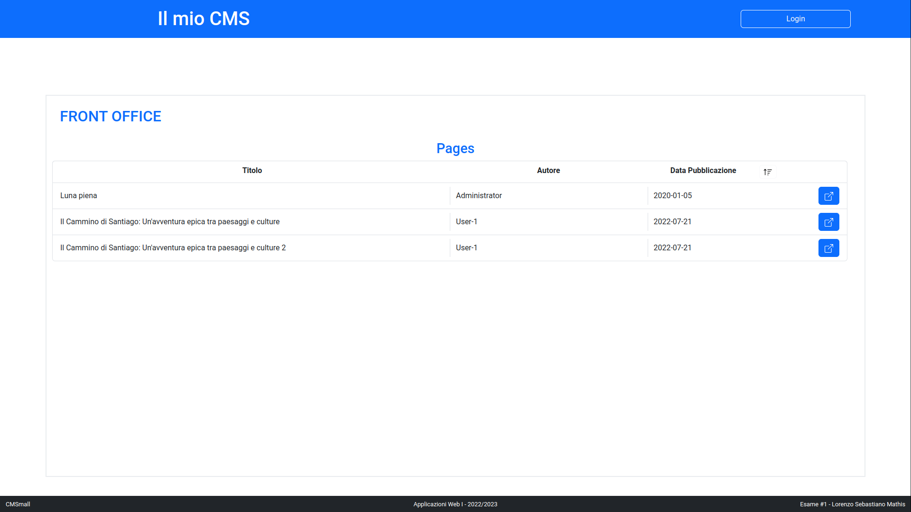

# Exam #1: "CMSmall"
## Student: s314875 MATHIS LORENZO SEBASTIANO 

## React Client Application Routes
- Route `/`: front office - pagina iniziale con la lista delle pagine pubblicate
- Route `/login`: pagina di login
- Route `/back-office`: back office - pagina di gestione delle pagine (solo per utenti autenticati)
- Route `/pages/:id`: visualizzazione di una pagina. Parametri:
  - `:id` identificativo della pagina da visualizzare
  - `?from=bo` query string opzionale che indica se la pagina è stata raggiunta dal back office (mostra il link al back office invece che al front office)
- Route `/pages/:id/edit`: schermata di modifica di una pagina. Parametri:
  - `:id` identificativo della pagina da modificare
- Route `/pages/new`: schermata di creazione di una nuova pagina.

### Note
- **Access control** delle routes:
  - `/`: accessibile a tutti (autenticati e non)
  - `/login`: accessibile a tutti (autenticati e non)
  - `/back-office`: accessibile solo agli utenti autenticati
  - `/pages/:id`: accessibile a tutti se la pagina è pubblicata, altrimenti solo agli utenti amministratore o autore della pagina
  - `/pages/:id/edit`: accessibile solo agli utenti amministratore o autore della pagina
  - `/pages/new`: accessibile solo agli utenti autenticati

## API Server

### Authentication API (authenticationAPI.js)
- **POST** `/api/authentication/` (**funzionalità: login**)
  - Autenticatizione non richiesta
  - Request: body `{"username": "xxx", "password": "yyy"}` [json]
  - Response: 200 OK - body `{"username": "xxx", "role": "xxx"}` [json]
  - Response errors: 
    - 400: bad request, `AUTHENTICATION_ERROR.ALREADY_LOGGED_IN` [json] `multipleLoginPrevent`
    - 400: bad request, `[VALIDATION_ERROR.MISSING_PARAMETERS]` [json] `login`
    - 401: unauthorized, `AUTHENTICATION_ERROR.INVALID_CREDENTIALS` [json] `login`
    - 500: server error, `AUTHENTICATION_ERROR.GENERIC_ERROR` [json] `login`
  ---
- **GET** `/api/authentication/current` (**funzionalità: richiesta dei dati dell'utente correntemente autenticato**)
  - Autenticazione richiesta
  - Request: nessun parametro
  - Response: 200 OK - body `{"username": "xxx", "role": "xxx"}` [json]
  - Response errors: 
    - 401: unauthorized, `AUTHENTICATION_ERROR.UNAUTHENTICATED_USER` [json] `loggedUser`
    - 401: unauthorized, `AUTHENTICATION_ERROR.CORRUPTED_SESSION` [json] `getCurrentUser`
    - 500: server error, `AUTHENTICATION_ERROR.GENERIC_ERROR` [json] `getCurrentUser`
  - Note: l'errore `AUTHENTICATION_ERROR.CORRUPTED_SESSION` vuol dire che esiste una sessione attiva ma non è possibile recuperare l'utente corrispondente.
  ---
- **DELETE** `/api/authentication/current` (**funzionalità: logout**)
  - Autenticazione non richiesta
  - Request: nessun parametro
  - Response: 204 No Content
  - Response errors: 
    - 400: bad request, `AUTHENTICATION_ERROR.NOT_LOGGED_IN` [json] `logout`

### Image API (imagesAPI.js)
- **GET** `/api/resources/images` (**funzionalità: richiesta della lista dei nomi delle immagini e del loro path**)
  - Autenticazione non richiesta
  - Request: nessun parametro
  - Response: 200 OK - `{ "images": ["name_1.jpg", ...], "path": "http://..."}` [json]
  - Response errors: nessuno

### Site Info API (siteInfoAPI.js)
- **GET** `/api/application-data/site-info` (**funzionalità: richiesta delle informazioni del sito**)
  - Autenticazione non richiesta
  - Request: nessun parametro
  - Response: 200 OK - `{ "siteName": "xxx" }` [json]
  - Response errors:
    - 404: not found, `SITE_INFO_ERROR.SITEINFO_NOT_FOUND` [json] `getSiteInfo`
    - 500: server error, `SITE_INFO_ERROR.GENERIC_ERROR` [json] `getSiteInfo`
  - Note: l'errore `SITE_INFO_ERROR.SITEINFO_NOT_FOUND` vuol dire che non è stato possibile recuperare le informazioni del sito dal DB.
  ---
- **PUT** `/api/application-data/site-info` (**funzionalità: modifica delle informazioni del sito**)
  - Autenticazione richiesta (solo utenti amministratore [role === 'admin'])
  - Request: body `{ "siteName": "xxx" }` [json]
  - Response: 204 No Content
  - Response errors:
    - 400: bad request, `[VALIDATION_ERROR.MISSING_PARAMETERS]` [json] `updateSiteInfo`
    - 401: unauthorized, `AUTHENTICATION_ERROR.UNAUTHENTICATED_USER` [json] `administratorUser`
    - 401: unauthorized, `AUTHENTICATION_ERROR.UNAUTHORIZED_USER` [json] `administratorUser`
    - 500: server error, `SITE_INFO_ERROR.UPDATE_FAILED` [json] `updateSiteInfo`

### User List API (userListAPI.js)
- **GET** `/api/application-data/user-list` (**funzionalità: richiesta della lista degli utenti**)
  - Autenticazione non richiesta
  - Request: nessun parametro
  - Response: 200 OK - `{ "users": ["xxx", ...] }` [json]
  - Response errors:
    - 500: server error, `USER_LIST_ERROR.GENERIC_ERROR` [json] `getUserList`

### Pages API (pagesAPI.js)
- **GET** `/api/application-data/pages` (**funzionalità: richiesta della lista delle pagine e dei loro contenuti**)
  - Autenticazione non richiesta
  - Request: nessun parametro
  - Response: 200 OK - `{ "pages": [page1, ...] }` [json]
  - Response errors:
    - 500: server error, `PAGES_ERROR.UNABLE_TO_GET_PAGES` [json] `getPages`
  ---
- **DELETE** `/api/application-data/pages/:id` (**funzionalità: cancellazione della pagina con `id === :id`**)
  - Autenticazione richiesta (solo utenti amministratore o autori della pagina [role === 'admin' || username === page.author])
  - Request: body vuoto, parametro :id nella route
  - Response: 204 No Content
  - Response errors:
    - 400: bad request, `[VALIDATION_ERROR.INVALID_VALUES.PAGES]` [json] `handleValidationErrors`
    - 401: unauthorized, `AUTHENTICATION_ERROR.UNAUTHENTICATED_USER` [json] `loggedUser`
    - 401: unauthorized, `AUTHENTICATION_ERROR.UNAUTHORIZED_USER` [json] `canModifyPage`
    - 401: unauthorized, `AUTHENTICATION_ERROR.GENERIC_ERROR` [json] `canModifyPage`
    - 404: not found, `PAGES_ERROR.PAGE_NOT_FOUND` [json] `pageExists
    - 500: server error, `PAGES_ERROR.UNABLE_TO_DELETE_PAGE` [json] `deletePage`
    - 500: server error, `PAGES_ERROR.GENERIC_ERROR` [json] `pageExists`
  ---
- **PUT** `/api/application-data/pages/:id` (**funzionalità: modifica della pagina con `id === :id`**)
  - Autenticazione richiesta (solo utenti amministratore o autori della pagina [role === 'admin' || username === page.author])
  - Request: body `page` [json], parametro :id nella route (***l'id presente nel body è ignorato***)
  - Response: 204 No Content
  - Response errors:
    - 400: bad request, `[VALIDATION_ERROR.INVALID_VALUES.PAGES]` [json] `handleValidationErrors`
    - 401: unauthorized, `AUTHENTICATION_ERROR.UNAUTHENTICATED_USER` [json] `loggedUser`
    - 401: unauthorized, `AUTHENTICATION_ERROR.UNAUTHORIZED_USER` [json] `canModifyPage, verifyAuthor`
    - 401: unauthorized, `AUTHENTICATION_ERROR.GENERIC_ERROR` [json] `canModifyPage, verifyAuthor`
    - 404: not found, `PAGES_ERROR.PAGE_NOT_FOUND` [json] `pageExists
    - 500: server error, `PAGES_ERROR.UNABLE_TO_DELETE_PAGE` [json] `deletePage`
    - 500: server error, `PAGES_ERROR.GENERIC_ERROR` [json] `pageExists, pageDataValidation`
  ---
- **POST** `/api/application-data/pages/` (**funzionalità: creazione di una nuova pagina**)
  - Autenticazione richiesta (solo utenti amministratore o autori della pagina [role === 'admin' || username === page.author])
  - Request: body `page` [json]
  - Response: 201 Created - `{ "id": "xxx" }` [json]
  - Response errors:
    - 400: bad request, `[VALIDATION_ERROR.INVALID_VALUES.PAGES]` [json] `handleValidationErrors`
    - 401: unauthorized, `AUTHENTICATION_ERROR.UNAUTHENTICATED_USER` [json] `loggedUser`
    - 401: unauthorized, `AUTHENTICATION_ERROR.UNAUTHORIZED_USER` [json] `verifyAuthor`
    - 401: unauthorized, `AUTHENTICATION_ERROR.GENERIC_ERROR` [json] `verifyAuthor`
    - 500: server error, `PAGES_ERROR.UNABLE_TO_CREATE_PAGE` [json] `createPage`
    - 500: server error, `PAGES_ERROR.GENERIC_ERROR` [json] `pageDataValidation`

## Database Tables

- Table `users`:
  - Contenuto: `id`, `username`, `hashed password`, `salt`, `role`
  - Schema:

| Colonna  | Tipo    | Proprietà                 | Vincoli | Descrizione                                                  |
|----------|---------|---------------------------|---------|--------------------------------------------------------------|
| id       | INTEGER | PRIMARY KEY AUTOINCREMENT | ---     | ID univoco dell'utente generato automaticamente dal database |
| username | TEXT    | NOT NULL UNIQUE           | none    | Username dell'utente                                         |
| password | TEXT    | NOT NULL                  | none    | Password dell'utente (hashata)                               |
| salt     | TEXT    | NOT NULL                  | none    | Salt utilizzato per l'hashing della password                 |
| role     | TEXT    | NOT NULL                  | none    | Ruolo dell'utente ['admin', 'user']                          |

- Table `pages`:
  - Contenuto: `id`, `title`, `author`, `pubblicationDate`, `creationDate`, `content`
  - Schema:

| Colonna         | Tipo    | Proprietà                   | Vincoli         | Descrizione                                                   |
|-----------------|---------|-----------------------------|-----------------|---------------------------------------------------------------|
| id              | INTEGER | PRIMARY KEY AUTOINCREMENT   | ---             | ID univoco della pagina generato automaticamente dal database |
| title           | TEXT    | NOT NULL                    | none            | Titolo della pagina                                           |
| author          | TEXT    | NOT NULL                    | users(username) | Autore della pagina                                           |
| publicationDate | TEXT    | ---                         | none            | Data di pubblicazione della pagina                            |
| creationDate    | TEXT    | NOT NULL                    | none            | Data di creazione della pagina                                |
| content         | TEXT    | NOT NULL                    | none            | Contenuto della pagina (JSON.stringify)                       |

  - Note: il campo content memorizza tutte le sezioni come JSON (`JSON.stringify`)
- Table `siteInfo`:
  - Contenuto: `id`, `fieldName`, `fieldValue`
  - Schema:

| Colonna         | Tipo    | Proprietà                   | Vincoli         | Descrizione                                                   |
|-----------------|---------|-----------------------------|-----------------|---------------------------------------------------------------|
| id              | INTEGER | PRIMARY KEY AUTOINCREMENT   | ---             | ID univoco della pagina generato automaticamente dal database |
| fieldName       | TEXT    | NOT NULL UNIQUE             | none            | Nome del campo                                                |
| fieldValue      | TEXT    | NOT NULL                    | none            | Valore del campo                                              |

- Table `images`:
  - Contenuto: `id`, `name`
  - Schema:

| Colonna         | Tipo    | Proprietà                   | Vincoli         | Descrizione                      |
|-----------------|---------|-----------------------------|-----------------|----------------------------------|
| id              | INTEGER | PRIMARY KEY AUTOINCREMENT   | ---             | ID univoco interno dell'immagine |
| name            | TEXT    | NOT NULL UNIQUE             | none            | Nome dell'immagine               |

## Main React Components `client/src/`
### `App.jsx`:
- `Main`: inizializzazione dei contesti, setup delle routes e fetch dei dati. Qui sono concentrate le useEffect e sono definite le funzioni di interfaccia alle API (login, logout, addPage, ecc.)
### `components/BackOffice.jsx`:
- `BackOffice`: schermata associata alla route `/back-office`. Struttura generale della schermata e access control.
- `Main`: contenuto della schermata di backoffice.
- `PageList` e `PageRecord`: lista delle entries delle pagine e singola entry. In `PageRecord` sono presenti i pulsanti per effettuare le operazioni sulla pagina e le relative verifiche dei permessi.
- `PagePreviewModal`: modal per la preview della pagina.
### `components/CreatePage.jsx`:
- `CreatePage`: schermata associata alla route `/pages/new`. Struttura generale della schermata e access control.
- `Main`: contenuto della schermata di creazione pagina.
### `components/EditPage.jsx`:
- `EditPage`: schermata associata alla route `/pages/:id/edit`. Struttura generale della schermata e access control.
- `Main`: contenuto della schermata di modifica pagina.
### `components/ErrorHandling.jsx`:
- `ErrorModal`: modal per la visualizzazione degli errori.
- `UnauthorizedDisclaimer`: componente per la visualizzazione di un disclaimer in caso di accesso non autorizzato.
- `NotFoundDisclaimer`: componente per la visualizzazione di un disclaimer in caso di pagina non trovata.
### `components/Footer.jsx`:
- `Footer`: footer del sito.
### `components/FrontOffice.jsx`:
- `FrontOffice`: schermata associata alla route `/`. Struttura generale della schermata.
- `Main`: contenuto della schermata di frontoffice.
- `PageList` e `PageRecord`: lista delle entries delle pagine e singola entry. In `PageRecord` è presente solo il pulsante che apre direttamente la pagina.
### `components/Header.jsx`:
- `Header`: header del sito.
- `UserSection` e `ChangeOffice`: sezioni dell´header per la gestione dell´utente e del cambio di schermata. Ognuna all'interno ha alcuni controlli a seconda dello stato dell'utente.
- `SiteNameModal`: modal per la modifica del nome del sito. Accessibile solo agli utenti amministratore.
### `components/Login.jsx`:
- `Login`: schermata associata alla route `/login`. Struttura generale della schermata.
- `LoginForm`: form per il login.
### `components/PageEditingComponents.jsx`:
- `PageForm`: form usato nella schermata di creazione di una nuova pagina e nella schermata di modifica di una pagina.
- Gli altri componenti sono le parti che compongono il form.
### `components/PageSections.jsx`:
- `PageSection`: componente '_interfaccia_' per la gestione delle sezioni di contenuto della pagina.
- `PageHeader`, `PageParagraph`, `PageImage`: componenti sezione del CMS.
### `components/PageView.jsx`:
- `PageView`: schermata associata alla route `/pages/:id`. Struttura generale della schermata e access control.
- `Main`: contenuto della schermata di visualizzazione pagina.

## Screenshots
### Front Office

  

### Back Office

  

### Login

  

### Creazione/Modifica Pagina

  

## Users Credentials
| Username | Password | Ruolo | Numero Pagine |
|----------|----------|-------|---------------|
| user1    | user1    | user  | 5             |
| user2    | user2    | user  | 3             |
| user3    | user3    | user  | 0             |
| admin1   | admin1   | admin | 4             |
| admin2   | admin2   | admin | 1             |

